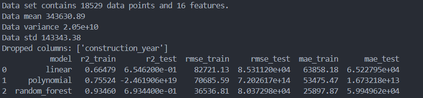
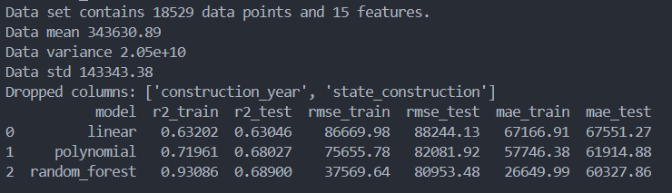

# Belgian house market, ML models 📈

## Project context 📝

This is the third part of a project that aims to create a machine learning model to predict the selling price of houses in Belgium.

Previous stages were:

- Scrapping the data from the real state website [Immoweb](https://www.immoweb.be/). See [repository](https://github.com/niels-demeyer/immo-eliza-scraping-scrapegoat).
- Analysing the data for business insights. See [repository](https://github.com/Yanina-Andriienko/immo-eliza-scrapeGOATS-analysis).

And now we are building and evaluating machine learning regression models for price prediction.

## Table of Contents

- [Data 📚](#Data-📚)
- [Prepossessing details 🧹](#Prepossessing-details-🧹)
- [Models details 🤖](#Models-details-🤖)
- [Performance 🎯](#Performance-🎯)
- [Limitations 🚧](#Limitations-🚧)
- [File structure 🗂️](#Limitations-🚧)
- [Usage 🛠️](#Limitations-🚧)
- [Timeline 📅](#timeline-📅)

## Data 📚

The final processed dataset contains 18529 properties, which were scrapped and treated in February 2024.

The target variable is:
- *price* (numerical): price of the house in euros.

The features available in the cleaned dataset were:

- *district* (categorical): Belgian province where a house is located.
- *area_total* (numerical): total area of the lot in sqm.
- *epc* (categorical, converted to numeric): Energy Performance Certificate of the house (A to G, where A is best). 
- *state_construction* (categorical): classification if the building needs or not improvements (GOOD, AS_NEW, TO_RENOVATE, TO_BE_DONE_UP, JUST_RENOVATED, TO_RESTORE).
- *construction_year* (numerical): year a house was built.
- *living_area* (numerical): total living area in sqm.
- *livingroom_surface* (numerical): living room area in sqm. 
- *kitchen_surface* (numerical): kitchen area in sqm.
- *bedrooms* (numerical): number of bedrooms available.
- *bathrooms* (numerical): number of bedrooms available.
- *facades* (numerical): exposed facades of the house (1 to 4).
- *has_garden* (boolean): boolean 0 (doesn't have) or 1 (have one).
- *kitchen* (boolean): 0 (no equipped kitchen) or 1 (some level of equipped kitchen).
- *has_terrace* (boolean): 0 (doesn't have) or 1 (have).
- *has_attic* (boolean): 0 (doesn't have) or 1 (have).
- *has_basement* (boolean): 0 (doesn't have) or 1 (have).

## Prepocessing details 🧹

### Splitting

Model evaluation was done via randomly sampling 20% of the data for test, and 80% for training.

### Inputting

Inputting was done in "livingroom_surface", "kitchen_surface" by applying an average % of their size relative to the living area.

For missing values in "epc", "facades", it was used k nearest neighbors. 

For "state_construction", the most frequent value.

### Encoding

For categorical ('district', 'state_construction') data that was not straighforth to rank without introducing bias, it was then applied one hot encoding.

## Models details 🤖

A linear, polynomial and random forest regression were tested.
At the end, the polynomial regression required to drop an extra column ("state_construction") for it to have meaningful metrics.
But by dropping such a column, other models were hurt. This is worth further investigation.

## Performance 🎯

For each set of columns that was dropped we can see the following metrics:

In conclusion, the random tree regressor was the best scoring model by dropping only the "construction_year" column. With the metrics of:

|   R2 |	RMSE (€) | MAE (€)|
| ----- | ------- | ---------- |
| 0.695 | 80150.5 | 59687.4 |

## Limitations 🚧

The model is only fitted for houses in Belgium according to Immoweb's subcategorization. 
Therefore other types of properties as apartments, or subtypes as chalets, farmhouses etc. were not considered for this model.

## File structure 🗂️

    ├── img
    ├── data
    │   ├── scapegoats.csv
    │   └── cleaned_houses.csv
    ├── models_pickle
    ├── cleaning.py
    ├── prepocessing.py
    ├── models.py
    ├── main.py
    ├── requirements.txt
    └── MODELSCARD.md

- img folder contains images for README and therefore was not detailed above.

- scapegoats.csv is the raw data set pre-cleaning
- cleaned_houses.csv is the post-cleaning csv file

- cleaning.py is the python file that uses scapegoats.csv and outputs cleaned_houses.csv
- preprocessing.py is the python file for preprocessing the data (inputting, encoding, scaling)
- models.py is the python file containing classes for each model and a class for metrics
- main.py is the python file that runs the preprocess and models classes and prints the metrics for each model.

All the processed models were stored as a pickle file in the models_pickle folder. Since we tested two different sets of columns to be dropped, we will have a model type 0 (drops only year or construction) and models type 1 (drops year of construciton and state of construction).

## Usage 🛠️

**Clone the repository using `git` command:**

    git clone git@github.com:andreaharit/05-immoeliza-ml-Andrea.git

**Navigate to the root of the repository using `cd` command**:

    cd 05-immoeliza-ml-Andrea

**Install the required packages using `pip` command:**

    pip3 install -r requirements.txt

**Regenerate, if necessary, the cleaned_houses.csv dataset**

This will overwrite the current csv file on the data folder.

    python3 cleaning.py

**Run the preprocessing and models via main**

    python3 main.py

## Timeline 📅

This project took 5 days to be completed.

